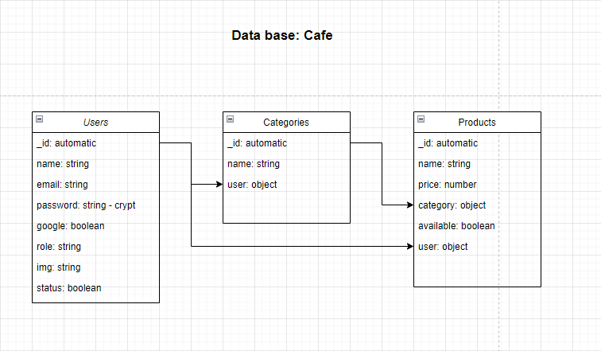

# Cafe App - Rest Server

## How to use

🔵 [Live Demo](https://rest-server-dl.herokuapp.com/)

Clone this repository and navigate to rest-server-v1 folder, install packages using `npm install` and execute project using `npm start`

```sh
git clone https://github.com/danielaliendo/rest-server-v1.git
cd rest-server-v1
npm install
npm start
```

Then open http://localhost:8080/ to see your app.

## ENV

As an example.env file, the application requires these environment variables to work:

- `PORT`: port server connection
- `MONGO_CNN`: mongo database connection string - [Mongo DB](https://www.mongodb.com/)
- `SECRET_PRIVATED_KEY`: a secret private key to generate and verify jwt tokens
- `GOOGLE_ON_AUTH_CLIENT_ID`:  OAuth Client ID - [Google Authentication](https://developers.google.com/identity/sign-in/web/sign-in)

## Dependencies
- [dotenv](https://github.com/motdotla/dotenv#readme)
- [express](http://expressjs.com/)
- [cors](https://github.com/expressjs/cors#readme)
- express
- express-validator
- google-auth-library
- jsonwebtoken
- mongoose 

## Database structure


### Author:
- Daniela Liendo | [LinkedIn](https://www.linkedin.com/in/daniela-liendo-026289189/) | [Email](mailto:danielaliendo@gmail.com)
